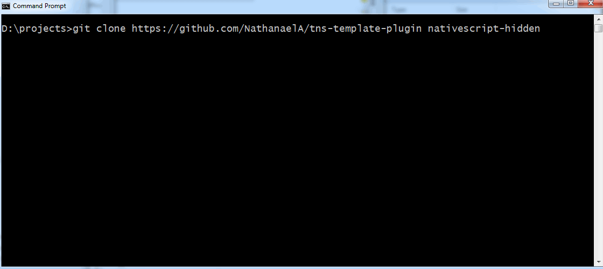

[](https://www.npmjs.com/package/tns-template-plugin)
[](https://www.npmjs.com/package/tns-template-plugin)
[](https://www.npmjs.com/package/tns-template-plugin)

# NativeScript Plugin Generator

A command-line generator that automatically builds [NativeScript plugins](https://docs.nativescript.org/plugins/plugins) with the following:

- Source code templates for iOS, Android, or both;
- A preconfigured `package.json` file, ready for publishing to npm;
- A fully-functional demo project;
- Complete TypeScript support, including `tsconfig.json` configuration (if needed).
- License, `README.md`, and `.gitignore` files.

## Instructions

To get started with the generator, clone this repository, navigate to the cloned directory, and run the `npm start` command.

```
git clone https://github.com/NathanaelA/tns-template-plugin nativescript-plugin-name
cd nativescript-plugin-name
npm start
```

The generator will ask you a series of questions, and use your answers to scaffold the plugin you desire. The generator will even remember answers to common questions in your `$HOME/.tns-plugin` folder, so that you don’t have to provide those answers on future plugins.



## License

This project itself is released under the MIT license; however, the code generated is released under no license, so that you can release your plugin under any license and claim all rights to the code contained here.
 
I also do contract work; so if you have a module you want built for NativeScript (or any other software projects), feel free to contact me [nathan@master-technology.com](mailto://nathan@master-technology.com).

[](https://www.paypal.com/cgi-bin/webscr?cmd=_donations&business=HN8DDMWVGBNQL&lc=US&item_name=Nathanael%20Anderson&item_number=nativescript%2dmastertechnology&no_note=1&no_shipping=1&currency_code=USD&bn=PP%2dDonationsBF%3ax%3aNonHosted)
[](https://www.patreon.com/NathanaelA)

## Updates

Please feel free to fork this repo and update it!!!

## Features
The `$HOME/.tns-plugin/` folder is used to store settings and additional files you may want added to any new plugins.

So if you would like to have your OWN custom `README.md` or `package.json` template used as the source, create a file in your `%HOMEPATH%` or `$HOME` `/.tns-plugin/files/` folder.

When parsing the files, the generator will look for any `\[[name]]`, `\[[github]]`, `\[[plugin]]`, `\[[email]]`, `\[[os]`, and `\[[license]` tokens, and replace them with the values you typed.

## Contributors

Alexander Ziskind / https://github.com/alexziskind1
